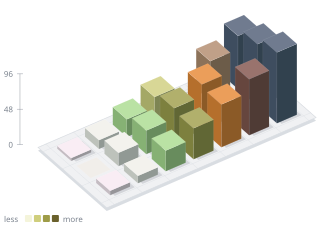

# heatmap-ui

[](https://github.com/tb962/heatmap-ui/actions/workflows/ci.yml)
[](https://www.npmjs.com/package/@tb962/heatmap-ui)
[](LICENSE)

A headless heatmap toolkit for React. Eight cell shapes, an interactive 3D mode
that runs on plain SVG, and control over every colour, size and label on the
grid.

**[Try it in the playground →](https://tb962.github.io/heatmap-ui/)**

```bash
npm install @tb962/heatmap-ui
```

```tsx
import { CalendarHeatmap } from "@tb962/heatmap-ui";
import "@tb962/heatmap-ui/styles.css";

<CalendarHeatmap values={days} weeks={20} showLegend />;
```

## What you get

Five entry points: `Heatmap` for any grid, `CalendarHeatmap` for dates, their
`Heatmap3D` and `CalendarHeatmap3D` counterparts, and `renderHeatmap3DSvg`,
which returns an SVG string without React or a DOM.

Everything below is a prop. None of it needs a wrapper, a fork, or a stylesheet
override.

| | |
| --- | --- |
| Cell shapes | `rounded`, `square`, `circle`, `diamond`, `hexagon`, `plus`, `bar`, `ring` |
| 3D forms | `rectangle`, `circle` (cylinder), `bar` (slender column) |
| 3D block styles | `solid`, `lego` (studs), `building` (windowed facades) |
| 3D themes | `green`, `night`, `seasonal`, `rainbow` |
| Surfaces | flat fills, or SVG bitmap patterns you define per colour level |
| Intensity | colour, cell size, or both |
| Shading | `linear`, `quantile`, `log`, or a function you supply |
| Colour | any ramp, palest first, with separate colours for zero and for no data |
| Labels | row and column labels, tooltips, and arbitrary content inside cells |
| Layout | cell size, gap, corner radius, and a predicate for hiding slots |

### The 3D mode

`Heatmap3D` draws an isometric scene in SVG. No WebGL, no canvas, no 3D library,
and no second bundle: it ships in the same package as the flat grid and takes
the same data, labels, tooltips, click handlers and legend props.

Height comes from the value itself rather than from its colour band, so a 40
is twice as tall as a 20. Blocks can be plain solids, LEGO bricks with
studs sized to fit, or buildings with lit windows. You can drive the camera
yourself or let the reader drag it. If you would rather ship a picture,
`renderHeatmap3DSvg` renders the identical scene to a string for an email or a
README.

### Customisation

Colour is a prop, not a theme file. Pass any ramp and the bands follow it. Pass
`faceColor` and you control the top, left and right fills of every 3D block
independently. Pass `patterns` and each colour level gets its own SVG bitmap,
written as binary or hexadecimal rows.

The stylesheet only handles structure and four CSS variables, so you are not
fighting a design system to make the chart look like yours.

### Data that stays honest

A slot with no observation is not a slot with a zero. Pass `known: false` and it
renders at reduced opacity and announces "No data" to a screen reader, instead
of quietly reading as a day off. Ragged grids are supported through
`isSlotHidden`, so a cohort table missing its future quarters does not have to
invent them.

Colour alone is invisible to roughly one reader in twelve, so `encode="size"`
and `encode="both"` carry intensity redundantly.

## The core

```tsx
import { Heatmap } from "@tb962/heatmap-ui";

<Heatmap rows={24} columns={7} values={matrix} />;
```

You can pass `values` in either form:

```ts
// Dense. null means no data; 0 means measured and empty.
values={[[3, 0, null], [1, 5, 2]]}

// Sparse. Anything not listed has no data.
values={[{ row: 0, column: 0, value: 3, known: true, meta: anything }]}
```

| Prop | Default | |
| --- | --- | --- |
| `rows`, `columns` | required | Grid size. |
| `values` | `[]` | Matrix or sparse cells. |
| `scale` | `"linear"` | `"linear"`, `"quantile"`, `"log"`, or `(value, all) => 0..1`. |
| `levels` | `colors.length` | Number of shade bands. |
| `thresholds` | none | Explicit band ceilings; skips `scale`. |
| `shape` | `"rounded"` | See below. |
| `encode` | `"color"` | `"color"`, `"size"`, or `"both"`. |
| `cellSize` | `13` | Pixels. |
| `gap` | `3` | Pixels. |
| `radius` | none | Overrides the shape's corner rounding. |
| `colors` | GitHub green | The ramp, palest first. |
| `emptyColor` | `#ebedf0` | A known value of zero. |
| `unknownOpacity` | `0.5` | Applied to slots with no data. |
| `isSlotHidden` | none | `(row, column) => boolean` for ragged grids. |
| `rowLabels`, `columnLabels` | none | Positioned against the grid. |
| `tooltip` | none | `(cell) => ReactNode`; opens on hover and focus. |
| `cellContent` | none | Optional visual React node centred inside each cell; values are hidden unless provided. |
| `cellLabel` | none | `(cell) => string`; the accessible name for a cell. |
| `onCellClick` | none | Makes cells buttons. |
| `showLegend` | `false` | less/more key, plus "no data" when relevant. |

### Shading

`scale="linear"` is the default. Bands are cut at even fractions of the largest
value, which is what GitHub and most other heatmaps do, so a reader who knows
one chart can read yours without relearning it.

Switch to `quantile` when the data has a long tail. Ranking the active values
keeps every band populated whatever the unit. On one real dataset, linear
banding put 58% of active days in the first band while quantile banding put 25%
in each:

```
linear    ████████████████████████████ ▓▓▓▓▓▓▓▓▓▓▓▓ ▒▒▒ ░░░░░
quantile  ████████████ ▓▓▓▓▓▓▓▓▓▓▓▓ ▒▒▒▒▒▒▒▒▒▒▒▒ ░░░░░░░░░░░░
```

`log` suits values spanning orders of magnitude. A function gets the value and
the full set and returns 0..1, and `thresholds` skips the whole question by
naming the band ceilings yourself.

## 3D heatmaps

Use `Heatmap3D` for any grid, or `CalendarHeatmap3D` for dates. Both render a
shaded, interactive SVG scene without WebGL.

```tsx
import { Heatmap3D, CalendarHeatmap3D } from "@tb962/heatmap-ui";
import "@tb962/heatmap-ui/styles.css";

<Heatmap3D
  rows={2}
  columns={3}
  values={[[20, 40, 80], [0, null, 60]]}
  shape="rectangle"
  blockStyle="lego"
  maxHeight={75}
  showLegend
  tooltip={cell => cell.known ? `${cell.value} events` : "No data"}
/>;

<CalendarHeatmap3D values={days} weeks={20} blockStyle="building" />;
```



Height is proportional to the actual value: with the default domain, 40 is
twice as tall as 20. The `scale`, `levels`, and `thresholds` props only affect
colour bands. LEGO studs fit inside that height. Measured zeroes are flat
tiles. Missing slots get an outline, and hidden slots are omitted.

| Prop | Default | Behaviour |
| --- | --- | --- |
| `shape` | `"rectangle"` | `"rectangle"`, `"circle"` (cylinder), or `"bar"` (slender column). |
| `blockStyle` | `"solid"` | `"solid"`, `"lego"` (studs), or `"building"` (windowed facades). |
| `theme` | `"green"` | `"green"`, `"night"`, `"seasonal"`, or `"rainbow"`; presets include face-aware palette neutrals. |
| `material` | `"solid"` | `"solid"` or `"pattern"`; pattern material uses SVG bitmap marks over each face. |
| `patterns` | built-in | Optional `{ top, side }` arrays of `{ width, bitmap, background, foreground }`, indexed by colour level. |
| `faceColor` | preset shading | `(args) => string` resolver for different top, left, and right fills. |
| `animation` | `"none"` | `"grow"` adds a staggered entrance; reduced motion uses a fade instead. |
| `maxHeight` | `100` | Maximum elevation in the same grid units as cell size and gap. |
| `heightDomain` | `[0, largest positive value]` | Fixed numeric domain for comparisons across charts. Out-of-range values clamp. |
| `yaw`, `pitch`, `zoom` | `-35`, `38`, `1` | Camera orbit, elevation, and magnification. |
| `onCameraChange` | none | Receives `{ yaw, pitch, zoom }` after camera interactions. |
| `interactive` | `true` | Enables pointer dragging and keyboard camera control. |
| `showControls` | `true` | Shows zoom and camera-reset buttons. |

3D accepts the same data, labels, tooltips, click callbacks, and legend props.
`encode`, `radius`, and `minScale` belong to the 2D component. Negative values
keep their labels but render at the zero plane. The 3D component is intended
for nonnegative activity and magnitude data.

Drag to orbit the scene. Focus the chart to use the arrow keys, `+` / `-`, or
`Home` to rotate, zoom, or reset it. Cells expose their values to assistive
technology. Click handlers also respond to Enter and Space.

### Patterns, themes, and static SVG

The built-in patterns are small and repeatable. A row can be a number, a
hexadecimal string, or a binary string. The most-significant bit is drawn on
the left:

```tsx
<Heatmap3D
  rows={1}
  columns={3}
  values={[[2, 8, 20]]}
  theme="night"
  material="pattern"
  animation="grow"
  patterns={{
    top: [{ width: 4, bitmap: ["1000", "0100", "0010", "0001"] }],
    side: [{ width: 2, bitmap: ["10", "01"] }],
  }}
/>
```

For an email, README image, or scheduled asset, use the same scene without React
or a DOM:

```ts
import { renderHeatmap3DSvg } from "@tb962/heatmap-ui";

const svg = renderHeatmap3DSvg({
  rows: 1,
  columns: 3,
  values: [[2, 8, 20]],
  theme: "seasonal",
  material: "pattern",
  showLegend: true,
});
```

`renderHeatmap3DSvg` uses the same height domain, geometry, face visibility,
paint order, themes, and pattern definitions as `Heatmap3D`. It returns an
accessible, non-interactive SVG snapshot.

## Shapes

| | |
| --- | --- |
| `rounded` `square` `circle` | The basic shapes. |
| `diamond` | A 45° square. Reads denser over long ranges. |
| `hexagon` | Offset rows, honeycomb. The standard form for hex-binned data. |
| `plus` | Stays legible at sizes where circles turn to mush. |
| `bar` | Height tracks the value; colour stays flat. |
| `ring` | Stroke thickness tracks the value. Works on any ground. |

## Encoding without colour

Colour alone is not enough for roughly one reader in twelve.

```tsx
<Heatmap encode="both" ... />
```

With `"size"`, each cell scales within its slot, so intensity still reads in
greyscale. `"both"` uses colour and size. `minScale` sets the smallest size for
the weakest cell.

### Values inside cells

Use `cellContent` for short values, counts, or other compact content. It is
separate from `cellLabel`, so a dense visual can still have a complete
accessible description:

```tsx
<Heatmap
  rows={7}
  columns={20}
  values={activity}
  cellContent={(cell) => cell.known && cell.value > 0 ? cell.value : null}
  cellLabel={(cell) => cell.known ? `${cell.value} events` : "No data"}
/>
```

The content is decorative to assistive technology; use `cellLabel` for its
meaning. This option belongs to the flat grid. The 3D component keeps values in
labels and tooltips, so it stays an SVG renderer without an HTML overlay.

## Calendar

```tsx
<CalendarHeatmap
  values={[{ date: "2026-09-07", value: 12 }]}
  to="2026-09-07"
  weeks={20}
  weekStart={1}
  showMonthLabels
  showWeekdayLabels
  unitLabel="commits"
  tooltip={(day) => `${day.date}: ${day.value}`}
/>
```

`weeks` defaults to 53 when omitted.

The calendar adapter handles date mapping, month labels, weekday labels, and a
default accessible name for each day. It hides days after `to` instead of
drawing them as missing, so a final partial column stays partial. Every
`Heatmap` prop passes through.

## Recipes

Most heatmap variants are just different grid dimensions. Each example below
uses `Heatmap`; the playground can generate the same code from its current
settings.

### Punchcard: hours down, weekdays across

```tsx
const hourLabels = Array.from({ length: 24 }, (_, i) => (i % 6 === 0 ? `${i}:00` : ""));
const dayLabels = ["Su", "Mo", "Tu", "We", "Th", "Fr", "Sa"]
  .map((text, column) => ({ column, text }));

<Heatmap
  rows={24}
  columns={7}
  values={commits}                    // number[24][7]
  rowLabels={hourLabels}
  columnLabels={dayLabels}
  ariaLabel="Commits by hour and weekday"
  tooltip={(cell) => `${cell.row}:00 — ${cell.value}`}
/>
```

### Cohort retention: a ragged grid

A cohort that signed up last week has no week-10 number until ten weeks pass.
That slot does not exist, so `isSlotHidden` removes it from the grid. This
differs from `known: false`, which represents an existing slot that was not
measured.

```tsx
<Heatmap
  rows={cohorts.length}
  columns={12}
  values={retention}                  // { row, column, value }[]
  isSlotHidden={(row, column) => column >= cohorts.length - row}
  rowLabels={cohorts}                 // ["Jul 6", "Jul 13", …]
  columnLabels={Array.from({ length: 12 }, (_, column) => ({ column, text: `W${column}` }))}
  ariaLabel="Retention by signup cohort"
  tooltip={(cell) => `Week ${cell.column} — ${cell.value}% retained`}
/>
```

### Uptime: wide and short, with days that were never collected

This is the other kind of gap: the slots exist, but nobody was watching them.

```tsx
<Heatmap
  rows={services.length}
  columns={30}
  values={uptime}                     // { row, column, value, known }[]
  rowLabels={services}                // ["api", "web", …]
  columnLabels={dayLabels}
  ariaLabel="Service uptime by day"
  tooltip={(cell) =>
    cell.known ? `${cell.value}% up` : "not monitored"}
/>
```

### Co-occurrence: symmetric, diagonal removed

The diagonal compares each label with itself, so it adds noise at full strength.
Hide it instead of letting it dominate the scale.

```tsx
<Heatmap
  rows={topics.length}
  columns={topics.length}
  values={overlap}                    // symmetric: value(i, j) === value(j, i)
  isSlotHidden={(row, column) => row === column}
  rowLabels={topics}
  columnLabels={topics.map((text, column) => ({ column, text }))}
  ariaLabel="Label co-occurrence"
/>
```

### A note on label density

`Heatmap` positions the labels you provide, but it cannot measure their width.
A label such as `"Wednesday"` can run into a neighbouring 16px column. Decide
how many labels fit in the calling code. Use shorter labels or thin them:

```tsx
// Keep only as many labels as the column stride can hold.
function thinLabels(texts, stride) {
  const widest = Math.max(...texts.map((t) => t.length)) * 6 + 8; // ~6px/char at 10px
  const step = Math.max(1, Math.ceil(widest / stride));
  return texts
    .map((text, column) => ({ column, text }))
    .filter((_, i) => i % step === 0);
}

columnLabels={thinLabels(dates, cellSize + gap)}
```

`CalendarHeatmap` already thins month labels when one would land too close to
the previous label.

## Accessibility

- The grid uses a labelled `group`, not `role="img"`, so the cells inside it can
  still receive focus.
- Cells receive focus only when they carry information, such as a `cellLabel`,
  `tooltip`, or `onCellClick`.
- Tooltips open on focus as well as hover, after a 300ms delay, and are wired
  with `aria-describedby`.
- `encode` lets you carry intensity without relying on colour alone.
- Hover and focus scaling is dropped under `prefers-reduced-motion`.

## Styling

The stylesheet handles structure. Props provide the colour, and the stylesheet
defines four variables you can override:

```css
.heatmap {
  --heatmap-tooltip-bg: …;
  --heatmap-tooltip-text: …;
  --heatmap-label: …;
  --heatmap-cell-content-color: …;
}
```

Tooltip colours follow `prefers-color-scheme`. Set
`data-heatmap-theme="light" | "dark"` to pin them.

## Playground

**<https://tb962.github.io/heatmap-ui/>**. No install required.

To run it from your working copy:

```bash
npm run build
npx serve .
```

Open `examples/playground.html`. You can switch between 2D and 3D, choose Solid,
LEGO, or Skyline cells, and orbit the scene. The graph choices include calendar,
punchcard, cohort retention, co-occurrence, and uptime. Adjust a prop and the
panel below the chart shows the exact code for the current view, including its
imports.

## Development

```bash
npm install
npm run typecheck
npm test
npm run build
```

For contribution details, see [CONTRIBUTING.md](CONTRIBUTING.md). To report a
vulnerability, see [SECURITY.md](SECURITY.md).

## License

MIT.
